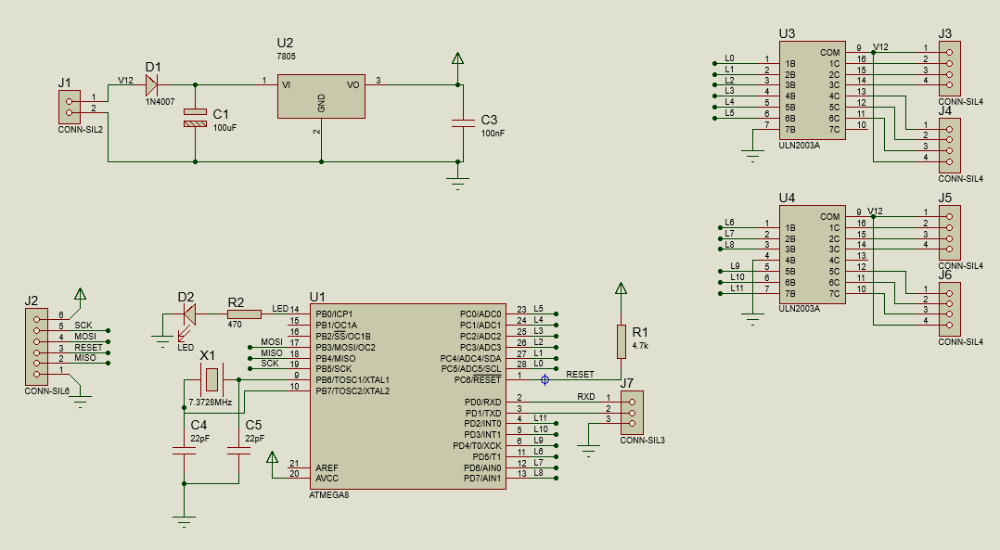
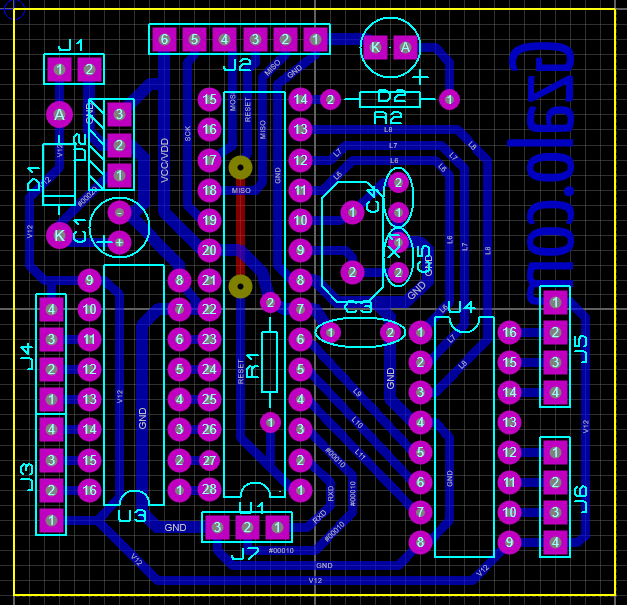
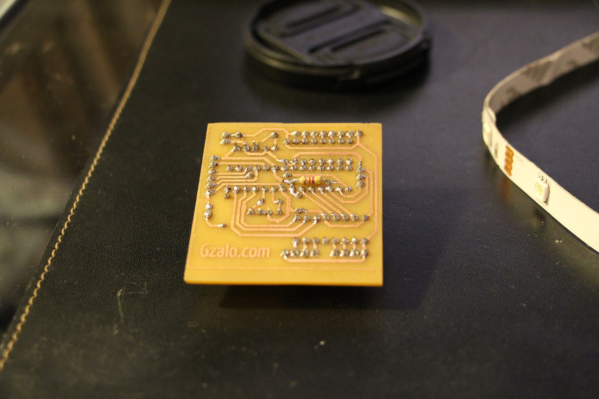

# RGBLeds
Basic 12V RGB LED strips controlled via PC, through a web interface.

## Hardware

Schematic:

Single sided PCB:

Built PCB

Editable Proteus file can be found in `pcb/rgbleds.pdsprj`.

## Firwmare
Firmware for the AVR ATMega8L can be found in the `firmware` folder. It requires an `avr-gcc` installation.

## Connections
The RGB strips are expected to have 4 pins (+12V, R, G, B) and are connected to the PCB using "DuPont" clone connectors.

## Software
The software to control the LEDs can be found inside `web/index.html`, and it can be opened directly in any modern Chrome version, without requiring any server.

### Random Trivia 
This project was originally created around 2014. The WebSerial interface was an example developed in 2020. The finishing touches were completed in 2021.

License: MIT
